# LingualLeaf

LingualLeaf is the dedicated PDF artifact shelf for [PocketPolyglot](https://github.com/lachlanchen/PocketPolyglot). It stores compressed final multilingual pocket-book PDFs, first-page previews, and the export manifest, while PocketPolyglot keeps the source text, JSON, TeX, scripts, and generation workflow.

Website: [learn.lazying.art](https://learn.lazying.art)  
Source/tooling repository: [lachlanchen/PocketPolyglot](https://github.com/lachlanchen/PocketPolyglot)

## What Is Here

- 94 compressed final PDFs under `docs/pocketpolyglot/books/`.
- 41 first-page preview images under `assets/max-language-previews/`.
- Color and black-white editions for every exported book.
- Maximum available language families: `jp-zh`, `en-jp-zh`, and `wenyan-en-jp-zh`.

<!-- POCKETPOLYGLOT_MAX_LANGUAGE:START -->
## Maximum-Language Pocket Editions

These are the richest available local editions for each completed book, rebuilt with a larger Shiji AgInTi-style font profile and compressed for GitHub when the result stays under normal GitHub file limits.

| Preview | Book | Family | Color PDF | Black-white PDF |
| --- | --- | --- | --- | --- |
| 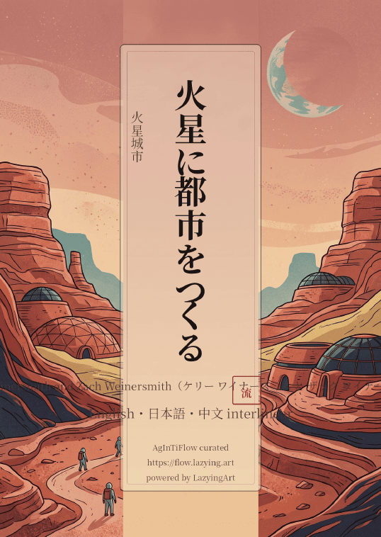 | `a-city-on-mars` | `en-jp-zh` | [color](docs/pocketpolyglot/books/en-jp-zh/a-city-on-mars/en-main-jp-zh/color/A City on Mars（日文・中文注）・最大語種・史記字級.pdf) | [black-white](docs/pocketpolyglot/books/en-jp-zh/a-city-on-mars/en-main-jp-zh/blackwhite/A City on Mars（日文・中文注・黑白）・最大語種・史記字級.pdf) |
| 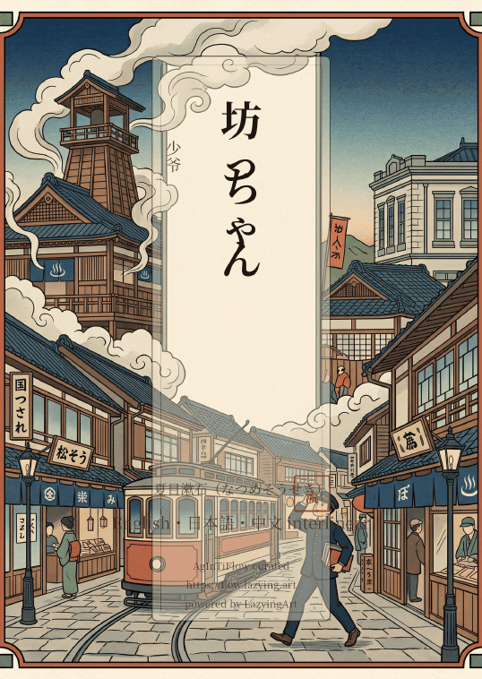 | `botchan` | `en-jp-zh` | [color](docs/pocketpolyglot/books/en-jp-zh/botchan/en-main-jp-zh/color/Botchan（日文・中文注）・最大語種・史記字級.pdf) | [black-white](docs/pocketpolyglot/books/en-jp-zh/botchan/en-main-jp-zh/blackwhite/Botchan（日文・中文注・黑白）・最大語種・史記字級.pdf) |
| 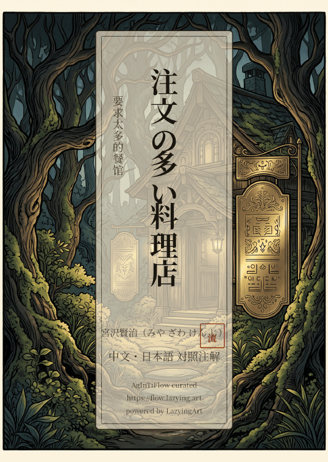 | `chumon-no-ooi-ryoriten` | `jp-zh` | [color](docs/pocketpolyglot/books/jp-zh/chumon-no-ooi-ryoriten/jp-main/color/注文の多い料理店（中文注）・最大語種・史記字級.pdf) | [black-white](docs/pocketpolyglot/books/jp-zh/chumon-no-ooi-ryoriten/jp-main/blackwhite/注文の多い料理店（中文注・黑白）・最大語種・史記字級.pdf) |
| 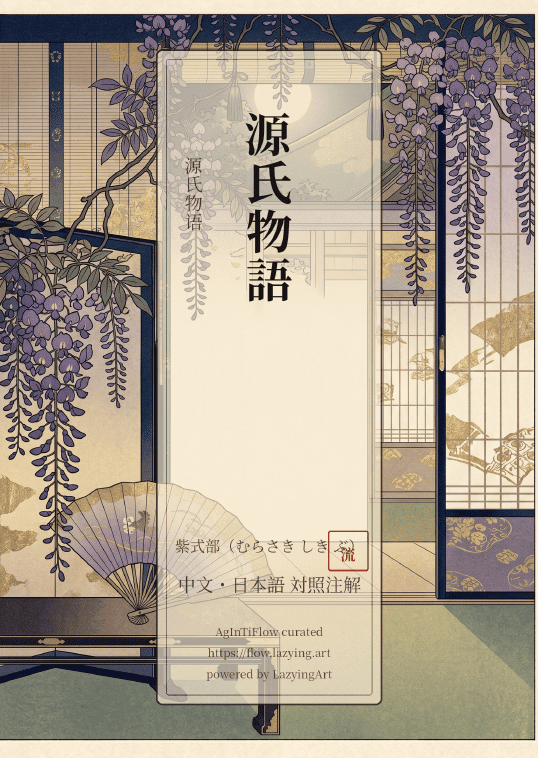 | `genji-modern` | `en-jp-zh` | [color](docs/pocketpolyglot/books/en-jp-zh/genji-modern/en-main-jp-zh/color/The Tale of Genji（日文・中文注）・最大語種・史記字級.pdf) | [black-white](docs/pocketpolyglot/books/en-jp-zh/genji-modern/en-main-jp-zh/blackwhite/The Tale of Genji（日文・中文注・黑白）・最大語種・史記字級.pdf) |
| 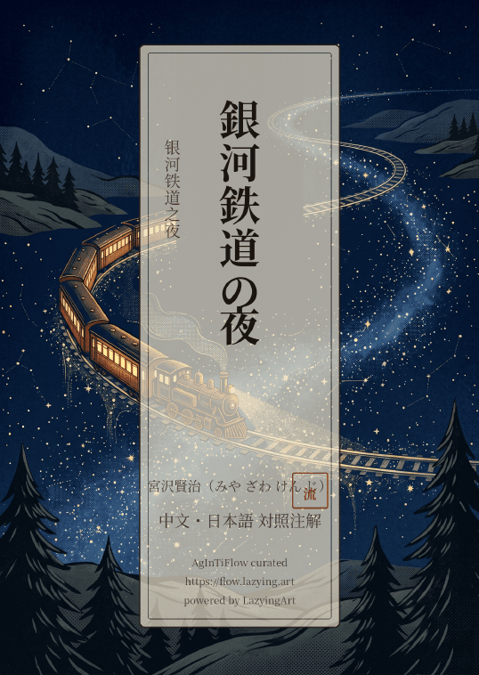 | `ginga-tetsudo` | `jp-zh` | [color](docs/pocketpolyglot/books/jp-zh/ginga-tetsudo/jp-main/color/銀河鉄道の夜（中文注）・最大語種・史記字級.pdf) | [black-white](docs/pocketpolyglot/books/jp-zh/ginga-tetsudo/jp-main/blackwhite/銀河鉄道の夜（中文注・黑白）・最大語種・史記字級.pdf) |
| 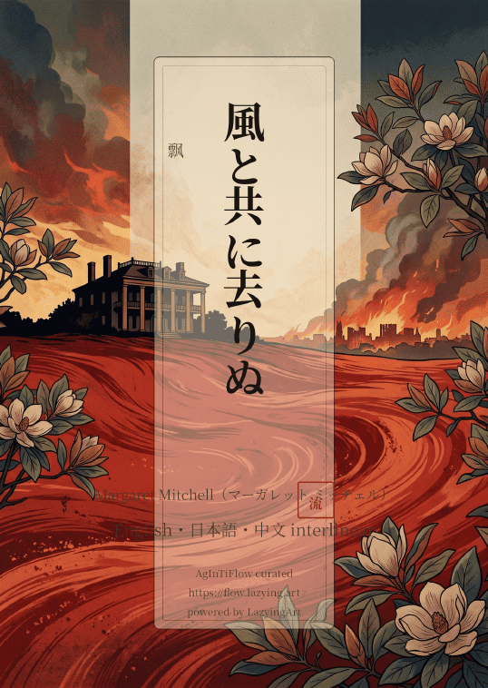 | `gone-with-the-wind` | `en-jp-zh` | [color](docs/pocketpolyglot/books/en-jp-zh/gone-with-the-wind/en-main-jp-zh/color/Gone With the Wind（日文・中文注）・最大語種・史記字級.pdf) | [black-white](docs/pocketpolyglot/books/en-jp-zh/gone-with-the-wind/en-main-jp-zh/blackwhite/Gone With the Wind（日文・中文注・黑白）・最大語種・史記字級.pdf) |
| 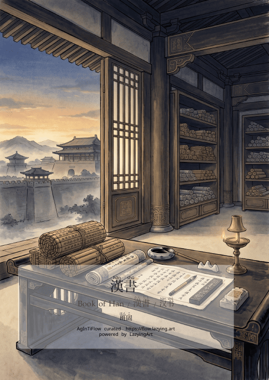 | `han-shu` | `wenyan-en-jp-zh` | [color](docs/pocketpolyglot/books/wenyan-en-jp-zh/han-shu/wenyan-main-quadrilingual/color/漢書（英文・現代日本語・現代中文注）・最大語種・史記字級.pdf) | [black-white](docs/pocketpolyglot/books/wenyan-en-jp-zh/han-shu/wenyan-main-quadrilingual/blackwhite/漢書（英文・現代日本語・現代中文注・黑白）・最大語種・史記字級.pdf) |
| 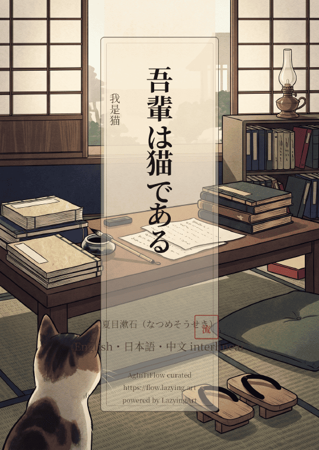 | `i-am-a-cat` | `en-jp-zh` | [color](docs/pocketpolyglot/books/en-jp-zh/i-am-a-cat/en-main-jp-zh/color/I Am a Cat（日文・中文注）・最大語種・史記字級.pdf) | [black-white](docs/pocketpolyglot/books/en-jp-zh/i-am-a-cat/en-main-jp-zh/blackwhite/I Am a Cat（日文・中文注・黑白）・最大語種・史記字級.pdf) |
| 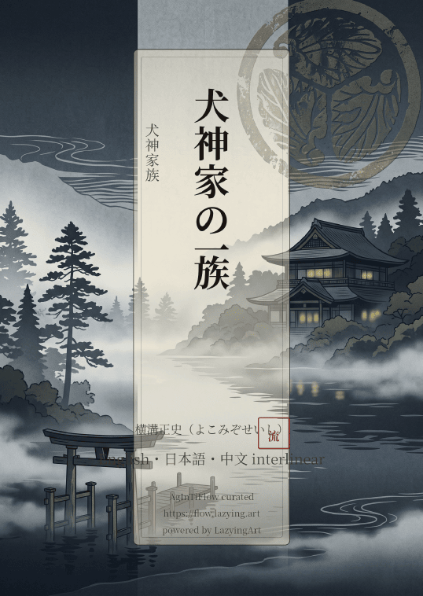 | `inugami-curse` | `en-jp-zh` | [color](docs/pocketpolyglot/books/en-jp-zh/inugami-curse/en-main-jp-zh/color/The Inugami Curse（日文・中文注）・最大語種・史記字級.pdf) | [black-white](docs/pocketpolyglot/books/en-jp-zh/inugami-curse/en-main-jp-zh/blackwhite/The Inugami Curse（日文・中文注・黑白）・最大語種・史記字級.pdf) |
| 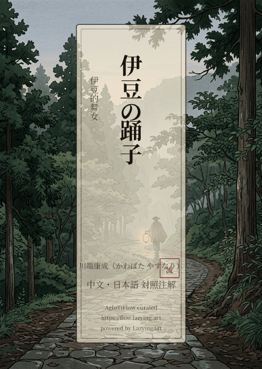 | `izu-no-odori` | `en-jp-zh` | [color](docs/pocketpolyglot/books/en-jp-zh/izu-no-odori/en-main-jp-zh/color/The Dancing Girl of Izu（日文・中文注）・最大語種・史記字級.pdf) | [black-white](docs/pocketpolyglot/books/en-jp-zh/izu-no-odori/en-main-jp-zh/blackwhite/The Dancing Girl of Izu（日文・中文注・黑白）・最大語種・史記字級.pdf) |
| 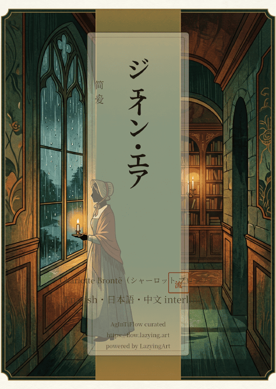 | `jane-eyre` | `en-jp-zh` | [color](docs/pocketpolyglot/books/en-jp-zh/jane-eyre/en-main-jp-zh/color/Jane Eyre（日文・中文注）・最大語種・史記字級.pdf) | [black-white](docs/pocketpolyglot/books/en-jp-zh/jane-eyre/en-main-jp-zh/blackwhite/Jane Eyre（日文・中文注・黑白）・最大語種・史記字級.pdf) |
| 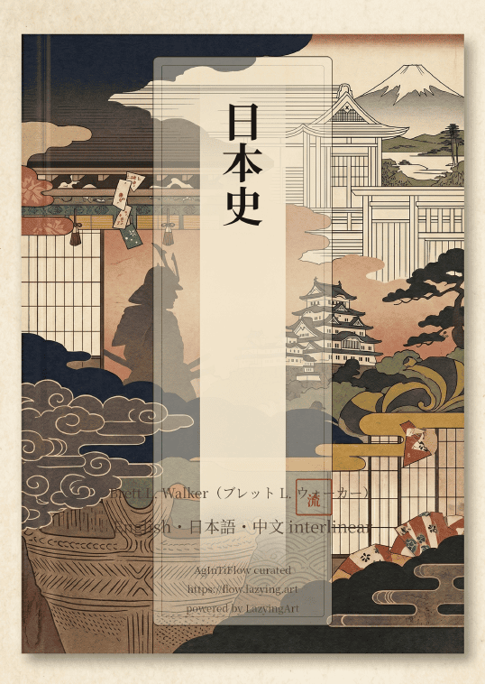 | `japanese-history` | `en-jp-zh` | [color](docs/pocketpolyglot/books/en-jp-zh/japanese-history/en-main-jp-zh/color/A Concise History of Japan（日文・中文注）・最大語種・史記字級.pdf) | [black-white](docs/pocketpolyglot/books/en-jp-zh/japanese-history/en-main-jp-zh/blackwhite/A Concise History of Japan（日文・中文注・黑白）・最大語種・史記字級.pdf) |
| 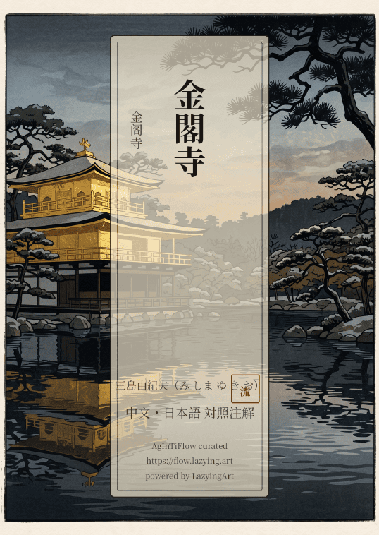 | `kinkakuji` | `en-jp-zh` | [color](docs/pocketpolyglot/books/en-jp-zh/kinkakuji/en-main-jp-zh/color/The Temple of the Golden Pavilion（日文・中文注）・最大語種・史記字級.pdf) | [black-white](docs/pocketpolyglot/books/en-jp-zh/kinkakuji/en-main-jp-zh/blackwhite/The Temple of the Golden Pavilion（日文・中文注・黑白）・最大語種・史記字級.pdf) |
| 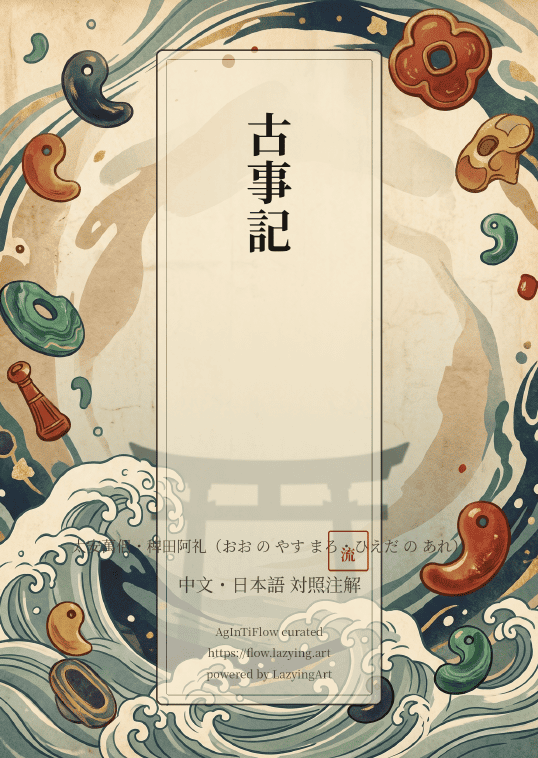 | `kojiki` | `jp-zh` | [color](docs/pocketpolyglot/books/jp-zh/kojiki/jp-main/color/古事記（中文注）・最大語種・史記字級.pdf) | [black-white](docs/pocketpolyglot/books/jp-zh/kojiki/jp-main/blackwhite/古事記（中文注・黑白）・最大語種・史記字級.pdf) |
| 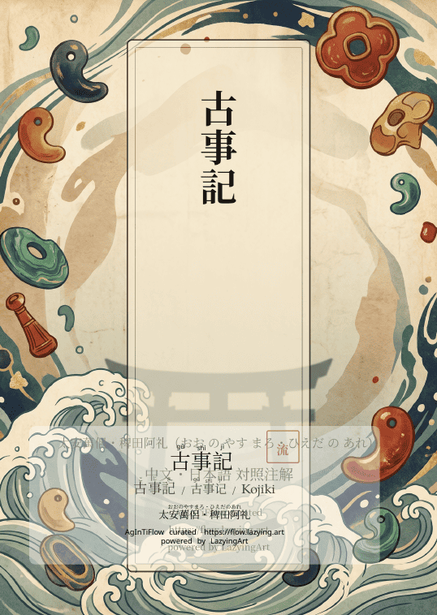 | `kojiki-wenyan` | `wenyan-en-jp-zh` | [color](docs/pocketpolyglot/books/wenyan-en-jp-zh/kojiki-wenyan/wenyan-main-quadrilingual/color/古事記（現代日本語・現代中文・英文注）・最大語種・史記字級.pdf) | [black-white](docs/pocketpolyglot/books/wenyan-en-jp-zh/kojiki-wenyan/wenyan-main-quadrilingual/blackwhite/古事記（現代日本語・現代中文・英文注・黑白）・最大語種・史記字級.pdf) |
| 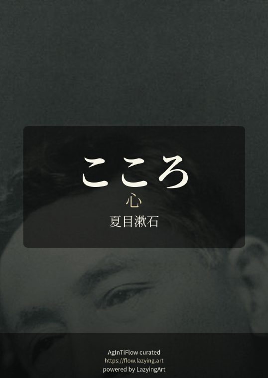 | `kokoro` | `en-jp-zh` | [color](docs/pocketpolyglot/books/en-jp-zh/kokoro/en-main-jp-zh/color/Kokoro（日文・中文注）・最大語種・史記字級.pdf) | [black-white](docs/pocketpolyglot/books/en-jp-zh/kokoro/en-main-jp-zh/blackwhite/Kokoro（日文・中文注・黑白）・最大語種・史記字級.pdf) |
| 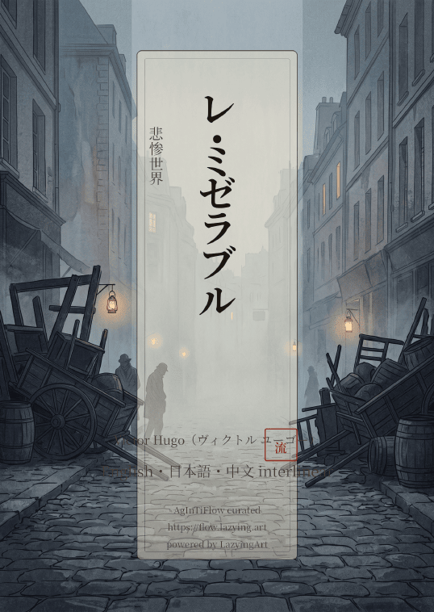 | `les-miserables` | `en-jp-zh` | [color](docs/pocketpolyglot/books/en-jp-zh/les-miserables/en-main-jp-zh/color/Les Misérables（日文・中文注）・最大語種・史記字級.pdf) | [black-white](docs/pocketpolyglot/books/en-jp-zh/les-miserables/en-main-jp-zh/blackwhite/Les Misérables（日文・中文注・黑白）・最大語種・史記字級.pdf) |
| 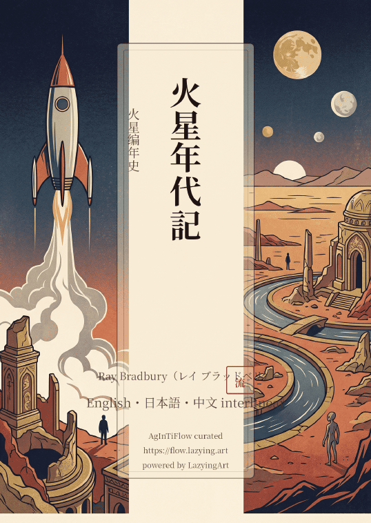 | `martian-chronicles` | `en-jp-zh` | [color](docs/pocketpolyglot/books/en-jp-zh/martian-chronicles/en-main-jp-zh/color/The Martian Chronicles（日文・中文注）・最大語種・史記字級.pdf) | [black-white](docs/pocketpolyglot/books/en-jp-zh/martian-chronicles/en-main-jp-zh/blackwhite/The Martian Chronicles（日文・中文注・黑白）・最大語種・史記字級.pdf) |
| 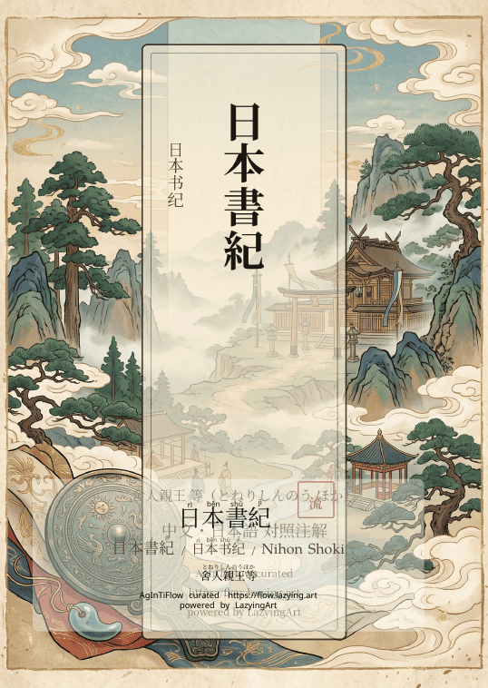 | `nihon-shoki` | `wenyan-en-jp-zh` | [color](docs/pocketpolyglot/books/wenyan-en-jp-zh/nihon-shoki/wenyan-main-quadrilingual/color/日本書紀（現代日本語・現代中文・英文注）・最大語種・史記字級.pdf) | [black-white](docs/pocketpolyglot/books/wenyan-en-jp-zh/nihon-shoki/wenyan-main-quadrilingual/blackwhite/日本書紀（現代日本語・現代中文・英文注・黑白）・最大語種・史記字級.pdf) |
| 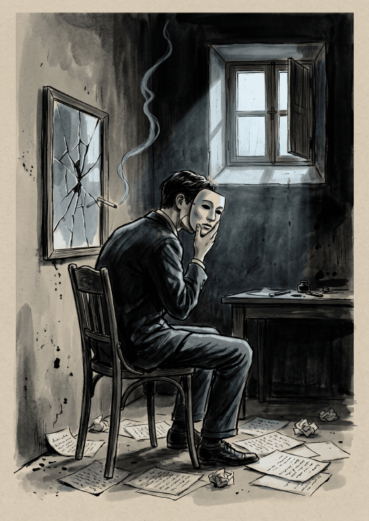 | `no-longer-human` | `en-jp-zh` | [color](docs/pocketpolyglot/books/en-jp-zh/no-longer-human/en-main-jp-zh/color/No Longer Human（日文・中文注）・最大語種・史記字級.pdf) | [black-white](docs/pocketpolyglot/books/en-jp-zh/no-longer-human/en-main-jp-zh/blackwhite/No Longer Human（日文・中文注・黑白）・最大語種・史記字級.pdf) |
| 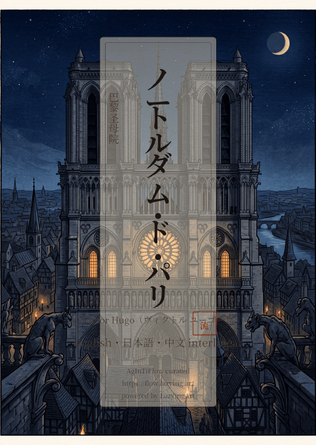 | `notre-dame-de-paris` | `en-jp-zh` | [color](docs/pocketpolyglot/books/en-jp-zh/notre-dame-de-paris/en-main-jp-zh/color/Notre-Dame de Paris（日文・中文注）・最大語種・史記字級.pdf) | [black-white](docs/pocketpolyglot/books/en-jp-zh/notre-dame-de-paris/en-main-jp-zh/blackwhite/Notre-Dame de Paris（日文・中文注・黑白）・最大語種・史記字級.pdf) |
| 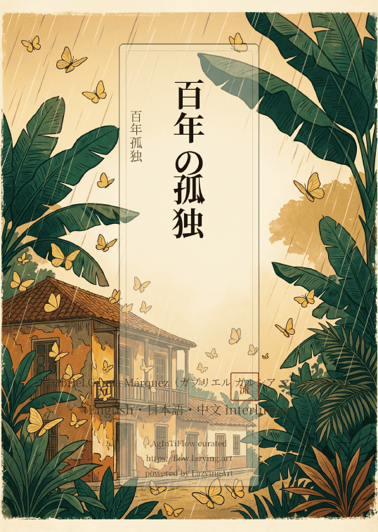 | `one-hundred-years-of-solitude` | `en-jp-zh` | [color](docs/pocketpolyglot/books/en-jp-zh/one-hundred-years-of-solitude/en-main-jp-zh/color/One Hundred Years of Solitude（日文・中文注）・最大語種・史記字級.pdf) | [black-white](docs/pocketpolyglot/books/en-jp-zh/one-hundred-years-of-solitude/en-main-jp-zh/blackwhite/One Hundred Years of Solitude（日文・中文注・黑白）・最大語種・史記字級.pdf) |
| 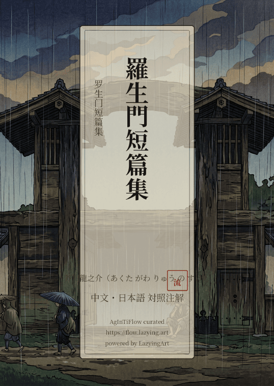 | `rashomon-stories` | `en-jp-zh` | [color](docs/pocketpolyglot/books/en-jp-zh/rashomon-stories/en-main-jp-zh/color/Rashomon Stories（日文・中文注）・最大語種・史記字級.pdf) | [black-white](docs/pocketpolyglot/books/en-jp-zh/rashomon-stories/en-main-jp-zh/blackwhite/Rashomon Stories（日文・中文注・黑白）・最大語種・史記字級.pdf) |
| 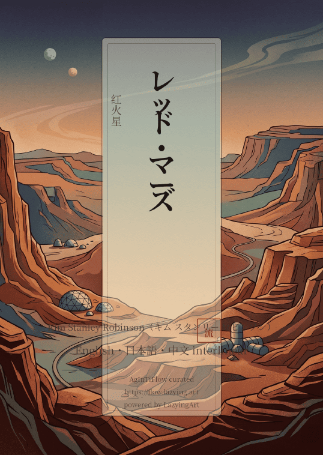 | `red-mars` | `en-jp-zh` | [color](docs/pocketpolyglot/books/en-jp-zh/red-mars/en-main-jp-zh/color/Red Mars（日文・中文注）・最大語種・史記字級.pdf) | [black-white](docs/pocketpolyglot/books/en-jp-zh/red-mars/en-main-jp-zh/blackwhite/Red Mars（日文・中文注・黑白）・最大語種・史記字級.pdf) |
| 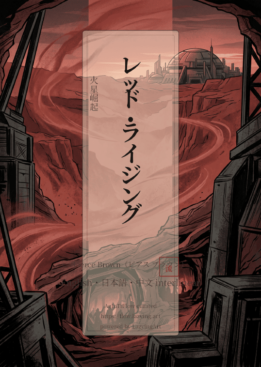 | `red-rising-1` | `en-jp-zh` | [color](docs/pocketpolyglot/books/en-jp-zh/red-rising-1/en-main-jp-zh/color/Red Rising（日文・中文注）・最大語種・史記字級.pdf) | [black-white](docs/pocketpolyglot/books/en-jp-zh/red-rising-1/en-main-jp-zh/blackwhite/Red Rising（日文・中文注・黑白）・最大語種・史記字級.pdf) |
| 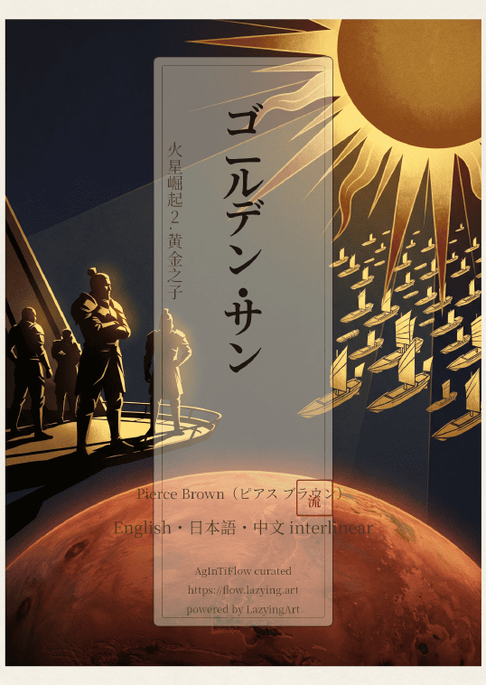 | `red-rising-2` | `en-jp-zh` | [color](docs/pocketpolyglot/books/en-jp-zh/red-rising-2/en-main-jp-zh/color/Golden Son（日文・中文注）・最大語種・史記字級.pdf) | [black-white](docs/pocketpolyglot/books/en-jp-zh/red-rising-2/en-main-jp-zh/blackwhite/Golden Son（日文・中文注・黑白）・最大語種・史記字級.pdf) |
| 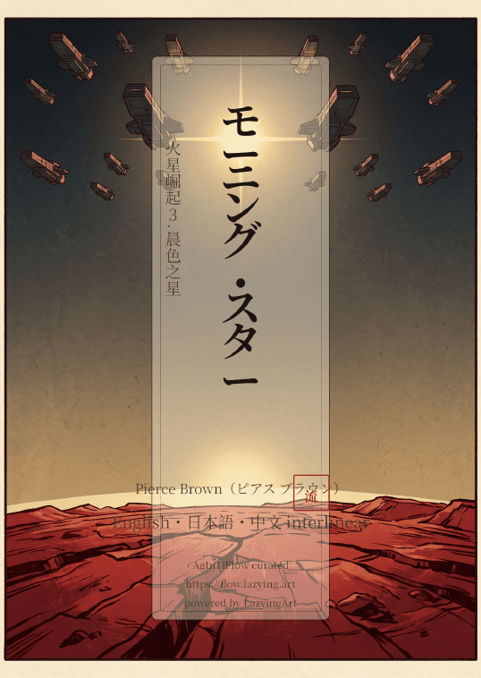 | `red-rising-3` | `en-jp-zh` | [color](docs/pocketpolyglot/books/en-jp-zh/red-rising-3/en-main-jp-zh/color/Morning Star（日文・中文注）・最大語種・史記字級.pdf) | [black-white](docs/pocketpolyglot/books/en-jp-zh/red-rising-3/en-main-jp-zh/blackwhite/Morning Star（日文・中文注・黑白）・最大語種・史記字級.pdf) |
| 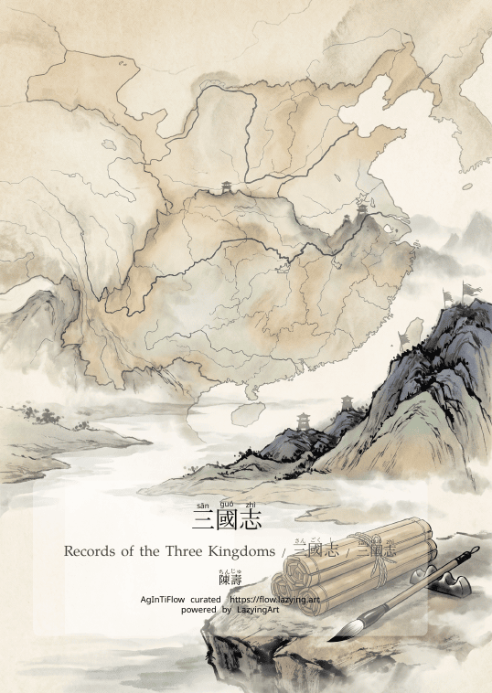 | `sanguozhi` | `wenyan-en-jp-zh` | [color](docs/pocketpolyglot/books/wenyan-en-jp-zh/sanguozhi/wenyan-main-quadrilingual/color/三國志（英文・現代日本語・現代中文注）・最大語種・史記字級.pdf) | [black-white](docs/pocketpolyglot/books/wenyan-en-jp-zh/sanguozhi/wenyan-main-quadrilingual/blackwhite/三國志（英文・現代日本語・現代中文注・黑白）・最大語種・史記字級.pdf) |
| 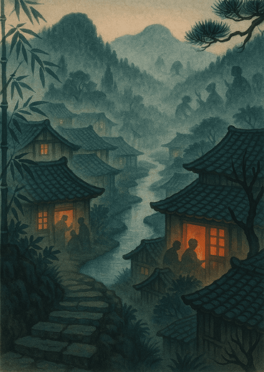 | `sichuan-folk-stories-vol1` | `jp-zh` | [color](docs/pocketpolyglot/books/jp-zh/sichuan-folk-stories-vol1/jp-main/color/中国民間故事集成四川巻上（中文注）・最大語種・史記字級.pdf) | [black-white](docs/pocketpolyglot/books/jp-zh/sichuan-folk-stories-vol1/jp-main/blackwhite/中国民間故事集成四川巻上（中文注・黑白）・最大語種・史記字級.pdf) |
| 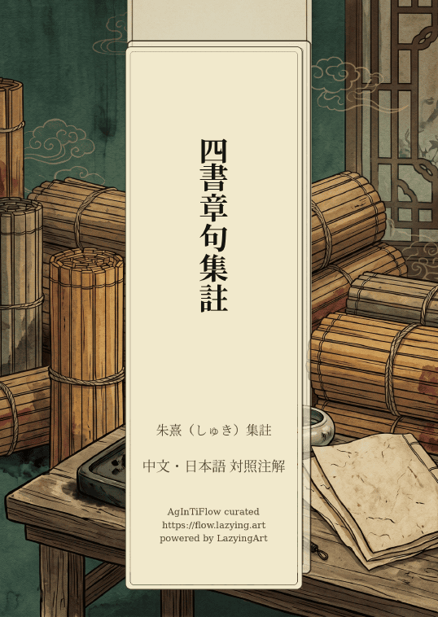 | `sishu-jizhu` | `jp-zh` | [color](docs/pocketpolyglot/books/jp-zh/sishu-jizhu/jp-main/color/四書章句集注（中文注）・最大語種・史記字級.pdf) | [black-white](docs/pocketpolyglot/books/jp-zh/sishu-jizhu/jp-main/blackwhite/四書章句集注（中文注・黑白）・最大語種・史記字級.pdf) |
| 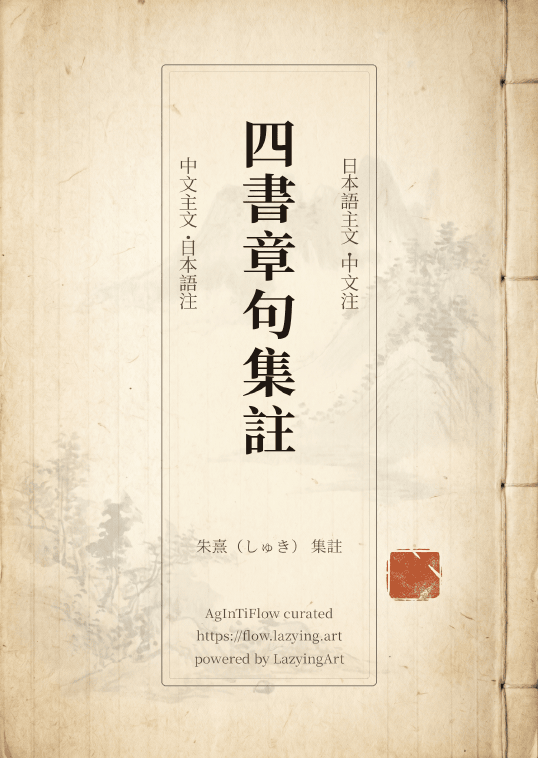 | `sishu-jizhu-aginti` | `jp-zh` | [color](docs/pocketpolyglot/books/jp-zh/sishu-jizhu-aginti/jp-main/color/四書章句集注（中文注）・最大語種・史記字級.pdf) | [black-white](docs/pocketpolyglot/books/jp-zh/sishu-jizhu-aginti/jp-main/blackwhite/四書章句集注（中文注・黑白）・最大語種・史記字級.pdf) |
|  | `snow-country` | `en-jp-zh` | [color](docs/pocketpolyglot/books/en-jp-zh/snow-country/en-main-jp-zh/color/Snow Country（日文・中文注）・最大語種・史記字級.pdf) | [black-white](docs/pocketpolyglot/books/en-jp-zh/snow-country/en-main-jp-zh/blackwhite/Snow Country（日文・中文注・黑白）・最大語種・史記字級.pdf) |
| 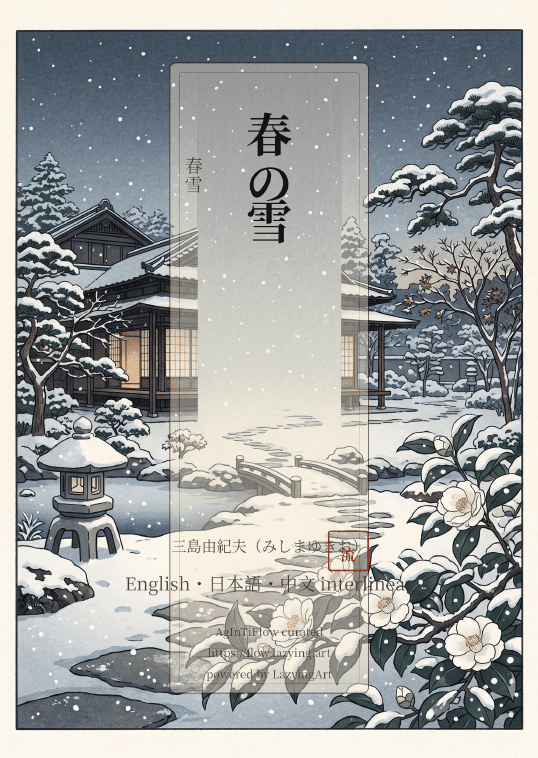 | `spring-snow` | `en-jp-zh` | [color](docs/pocketpolyglot/books/en-jp-zh/spring-snow/en-main-jp-zh/color/Spring Snow（日文・中文注）・最大語種・史記字級.pdf) | [black-white](docs/pocketpolyglot/books/en-jp-zh/spring-snow/en-main-jp-zh/blackwhite/Spring Snow（日文・中文注・黑白）・最大語種・史記字級.pdf) |
| 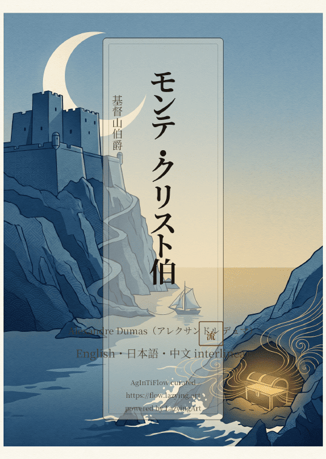 | `the-count-of-monte-cristo` | `en-jp-zh` | [color](docs/pocketpolyglot/books/en-jp-zh/the-count-of-monte-cristo/en-main-jp-zh/color/The Count of Monte Cristo（日文・中文注）・最大語種・史記字級.pdf) | [black-white](docs/pocketpolyglot/books/en-jp-zh/the-count-of-monte-cristo/en-main-jp-zh/blackwhite/The Count of Monte Cristo（日文・中文注・黑白）・最大語種・史記字級.pdf) |
| 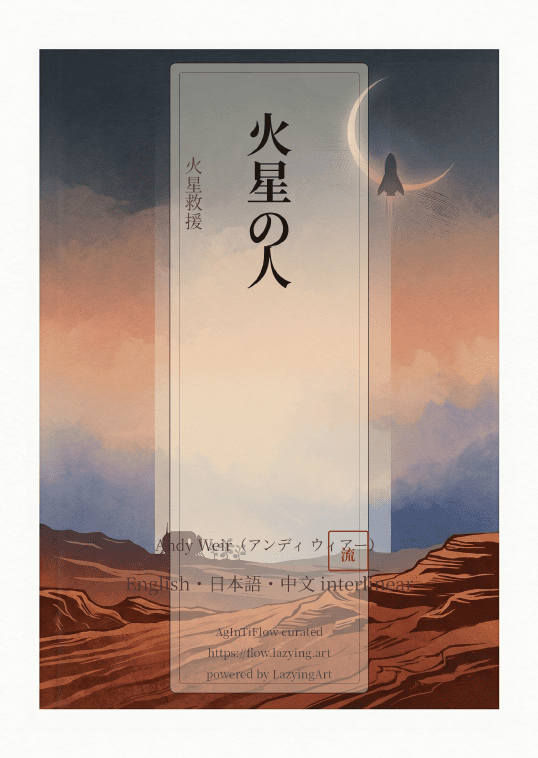 | `the-martian` | `en-jp-zh` | [color](docs/pocketpolyglot/books/en-jp-zh/the-martian/en-main-jp-zh/color/The Martian（日文・中文注）・最大語種・史記字級.pdf) | [black-white](docs/pocketpolyglot/books/en-jp-zh/the-martian/en-main-jp-zh/blackwhite/The Martian（日文・中文注・黑白）・最大語種・史記字級.pdf) |
| 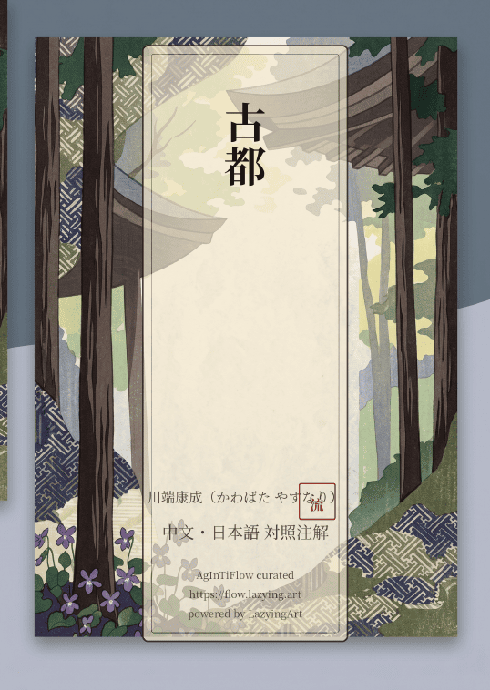 | `the-old-capital` | `en-jp-zh` | [color](docs/pocketpolyglot/books/en-jp-zh/the-old-capital/en-main-jp-zh/color/The Old Capital（日文・中文注）・最大語種・史記字級.pdf) | [black-white](docs/pocketpolyglot/books/en-jp-zh/the-old-capital/en-main-jp-zh/blackwhite/The Old Capital（日文・中文注・黑白）・最大語種・史記字級.pdf) |
| 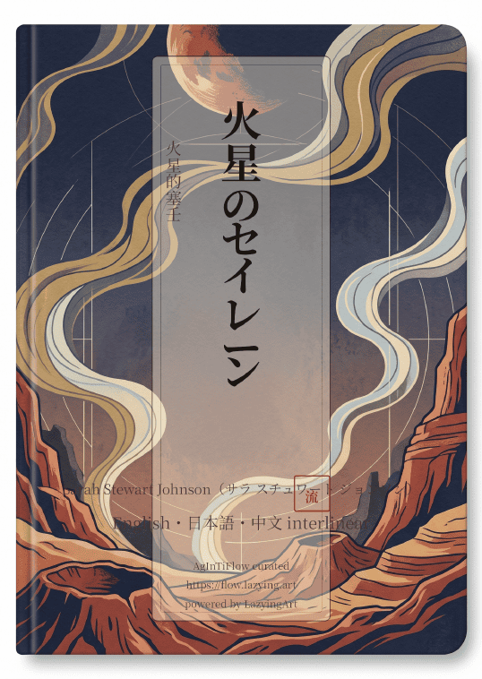 | `the-sirens-of-mars` | `en-jp-zh` | [color](docs/pocketpolyglot/books/en-jp-zh/the-sirens-of-mars/en-main-jp-zh/color/The Sirens of Mars（日文・中文注）・最大語種・史記字級.pdf) | [black-white](docs/pocketpolyglot/books/en-jp-zh/the-sirens-of-mars/en-main-jp-zh/blackwhite/The Sirens of Mars（日文・中文注・黑白）・最大語種・史記字級.pdf) |
| 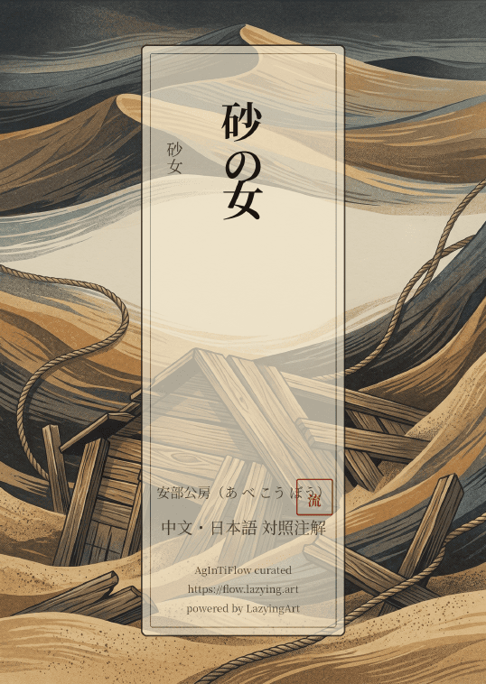 | `woman-in-the-dunes` | `en-jp-zh` | [color](docs/pocketpolyglot/books/en-jp-zh/woman-in-the-dunes/en-main-jp-zh/color/The Woman in the Dunes（日文・中文注）・最大語種・史記字級.pdf) | [black-white](docs/pocketpolyglot/books/en-jp-zh/woman-in-the-dunes/en-main-jp-zh/blackwhite/The Woman in the Dunes（日文・中文注・黑白）・最大語種・史記字級.pdf) |
| 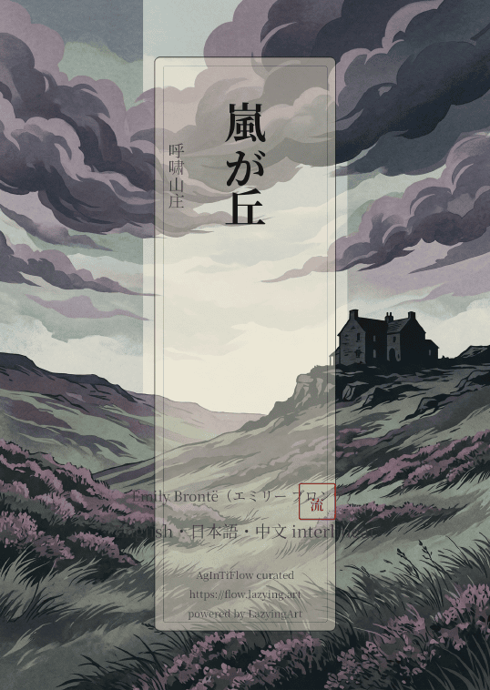 | `wuthering-heights` | `en-jp-zh` | [color](docs/pocketpolyglot/books/en-jp-zh/wuthering-heights/en-main-jp-zh/color/Wuthering Heights（日文・中文注）・最大語種・史記字級.pdf) | [black-white](docs/pocketpolyglot/books/en-jp-zh/wuthering-heights/en-main-jp-zh/blackwhite/Wuthering Heights（日文・中文注・黑白）・最大語種・史記字級.pdf) |
| 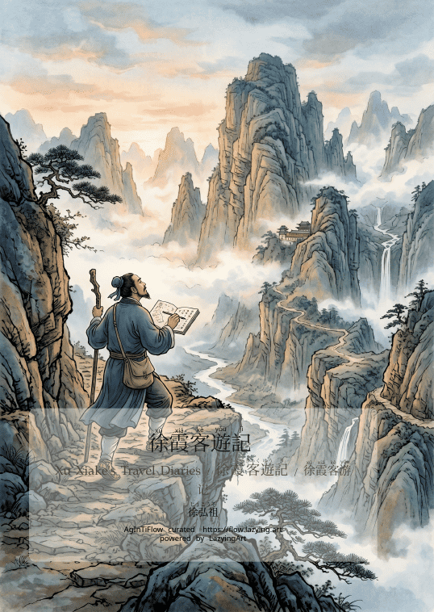 | `xu-xiake-youji` | `wenyan-en-jp-zh` | [color](docs/pocketpolyglot/books/wenyan-en-jp-zh/xu-xiake-youji/wenyan-main-quadrilingual/color/徐霞客遊記（英文・現代日本語・現代中文注）・最大語種・史記字級.pdf) | [black-white](docs/pocketpolyglot/books/wenyan-en-jp-zh/xu-xiake-youji/wenyan-main-quadrilingual/blackwhite/徐霞客遊記（英文・現代日本語・現代中文注・黑白）・最大語種・史記字級.pdf) |
| 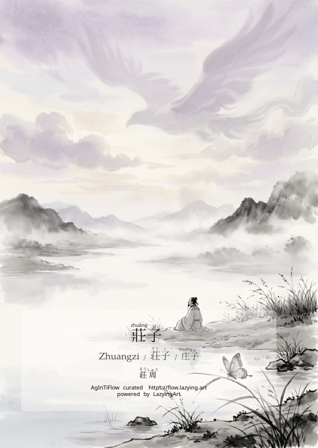 | `zhuangzi` | `wenyan-en-jp-zh` | [color](docs/pocketpolyglot/books/wenyan-en-jp-zh/zhuangzi/wenyan-main-quadrilingual/color/莊子（英文・現代日本語・現代中文注）・最大語種・史記字級.pdf) | [black-white](docs/pocketpolyglot/books/wenyan-en-jp-zh/zhuangzi/wenyan-main-quadrilingual/blackwhite/莊子（英文・現代日本語・現代中文注・黑白）・最大語種・史記字級.pdf) |

Full artifact manifest: [references/MAX_LANGUAGE_SHIJI_FONT_EXPORTS.md](references/MAX_LANGUAGE_SHIJI_FONT_EXPORTS.md).
<!-- POCKETPOLYGLOT_MAX_LANGUAGE:END -->
